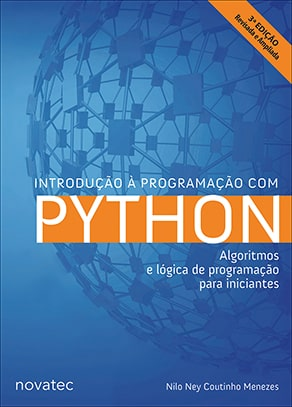

<h1 align="center">
	<strong>Exercises from the book: <a href="https://python.nilo.pro.br/index.html">Introduction to Programming with Python - 3rd Edition</a> 📖🐍</strong>
</h1>

  

  

  

## 📘 About the Book

The book covers basic programming concepts such as expressions, variables, loops, decisions, lists, dictionaries, sets, functions, files, classes, objects, and databases with SQLite 3, using the [Python][python] language. These topics are presented one by one with examples and exercises. The work aims to explore computer programming as a daily tool.

* **Title:** [Introduction to Programming with Python](https://www.novatec.com.br/livros/introducao-python-3ed/) 
* **Author:** [Nilo Ney Coutinho Menezes](https://www.nilo.pro.br/) 
* **Edition:** Third 
* **Publisher:** [Novatec](https://novatec.com.br/) 
* **Year:** 2019 

## 📋 Table of Contents

Access the [**PDF Table of Contents**](https://s3.novatec.com.br/sumarios/sumario-9788575227183.pdf) of the book.

## 💡 Motivation

Repository created for study and activity recording.

## 📃 License

The repository is under the [MIT][mit] license. See the [LICENSE](https://github.com/bryan-lima/exercicios-livro-introd-prog-python-3ed/blob/master/LICENSE) file for more details.

[python]: https://www.python.org/
[mit]: https://opensource.org/licenses/MIT
